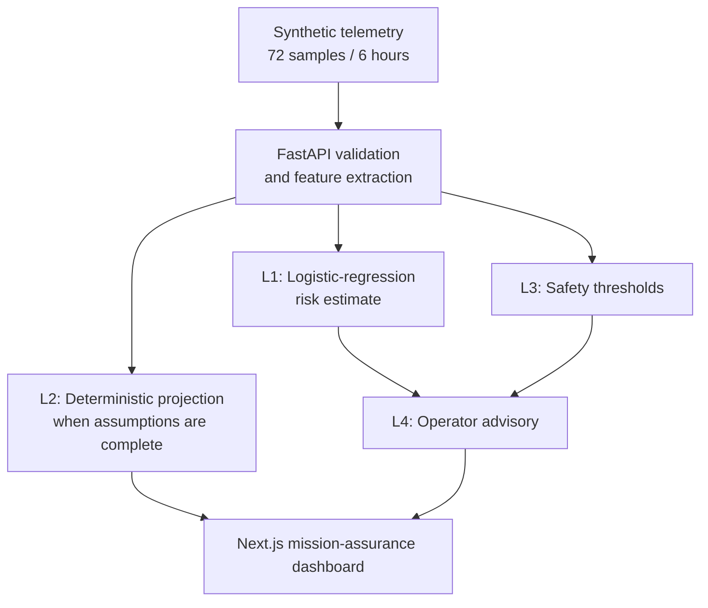

# SpaceBNS

**Evidence-grounded, forecast-aware, policy-constrained power-risk advisory for resource-limited spacecraft**

[](#challenge-fit)
[](LICENSE)
[](#validation-evidence)

SpaceBNS is a public proof-of-concept developed by **BNS Innovation** for the
IBM August Challenge. It turns a recent spacecraft power-telemetry window into
an explainable risk estimate, an optional deterministic projection, explicit
safety findings, and a human-facing advisory.

> **Safety and maturity notice:** SpaceBNS uses synthetic data only. It is not
> flight-qualified, is not connected to a spacecraft, and cannot authorize or
> transmit spacecraft commands. Every prediction response declares
> `command_authority: "NONE"`.

## Live demonstration

- **3-minute project demo:** https://youtu.be/dAUYIlgKXaA
- **90-second judge guide:** [JUDGE.md](JUDGE.md)
- **Mission-assurance dashboard:** https://spacebns.vercel.app/
- **API health:** https://spacebns-api.onrender.com/health
- **Public prediction response:** https://spacebns-api.onrender.com/api/v1/mock/power-risk-prediction

The backend uses a free hosting tier and may require up to approximately one
minute to wake after inactivity. The dashboard will show a safe unavailable
state until the API responds; use its manual retry control after wake-up.

## Challenge fit

**August Challenge — Advance Space Exploration with AI**

Resource-limited spacecraft require operators to recognize power risk early,
without confusing a statistical estimate with physical certainty or allowing
AI output to become a command. The MVP addresses one bounded question:

> Given the latest six hours of synthetic power telemetry, what is the
> estimated probability of a power-constraint breach within 24 hours, what
> safety evidence is active, and what advisory should a human operator review?

## What the MVP does

1. Validates a 72-sample history at five-minute cadence.
2. Extracts a frozen 12-feature power vector.
3. Produces an L1 logistic-regression breach estimate and feature
   contributions.
4. Produces an L2 deterministic 24-hour energy projection only when all
   required physical assumptions are supplied.
5. Evaluates L3 deterministic safety thresholds against the latest sample.
6. Derives an L4 operator advisory from L1 and L3.
7. Returns the mandatory safety envelope on success, degraded, and error paths.
8. Renders the result in a responsive Next.js dashboard with runtime response
   validation, manual retry, and no polling.

The system fails closed. It does not invent a physical projection when battery
capacity, load, conversion efficiency, sunlight, or payload-schedule
assumptions are missing.

## Architecture



| Layer | Output | Authority boundary |
| --- | --- | --- |
| L1 — AI estimate | Breach probability, predicted class, top contributions | Synthetic-distribution association; not physical causation |
| L2 — deterministic projection | 24 hourly state-of-charge points or an omission reason | Not AI; never fabricated without complete assumptions |
| L3 — safety thresholds | Explicit findings from the latest sample | Deterministic rules |
| L4 — operator advisory | Risk summary, recommendation, basis, human-action flag | Advisory only; no automated action |

See [the architecture document](docs/architecture.md) and the
[power-risk implementation contract](docs/power-risk-contract.md) for the
detailed boundaries.

## Safety envelope

Every normal, degraded, and error response preserves these fields:

```json
{
  "data_source": "SYNTHETIC",
  "prototype_status": "NOT_FLIGHT_QUALIFIED",
  "command_authority": "NONE",
  "policy_decision": "PERMITTED_FOR_SIMULATION_ONLY"
}
```

Malformed, missing, non-finite, out-of-range, or incorrectly ordered telemetry
is rejected. Public errors use fixed codes and do not expose raw request bodies,
filesystem paths, stack traces, or internal exceptions.

## AI and scientific disclosure

- Model: `StandardScaler` → `LogisticRegression`, version `0.1.1`.
- Label: `power_constraint_breach_within_24h`.
- Data: 300 synthetic scenarios generated with seed 42; no real-spacecraft
  telemetry.
- Split: 180 train, 60 validation, and 60 held-out test scenarios, each
  class-balanced.
- Selection: regularization strength selected using train and validation data
  only.
- Final fit: 240 train-plus-validation scenarios.
- Numerical safeguard: features with no measurable variation are retained in
  the 12-field schema but neutralized. In the frozen model,
  `solar_current_slope` has scale `1.0` and coefficient `0.0`.
- Interpretation: contributions are standardized value × coefficient. They are
  learned associations, not proven physical causes.

The held-out test split was evaluated once after the model was frozen:

| Metric | Result | Contract gate |
| --- | ---: | ---: |
| ROC AUC | 1.000000 | ≥ 0.80 |
| Recall | 1.000000 | ≥ 0.75 |
| Precision | 0.666667 | ≥ 0.65 |
| F1 | 0.800000 | ≥ 0.70 |
| Brier score | 0.143790 | ≤ 0.20 |
| Leakage violations | 0 | = 0 |
| Breach-eligibility violations | 0 | = 0 |

The confusion matrix was `[[15, 15], [0, 30]]` in
`[[TN, FP], [FN, TP]]` order. The prototype caught all 30 synthetic positive
cases but produced 15 false positives; its precision only narrowly exceeds the
contract threshold. These results describe the held-out synthetic distribution
only and must not be interpreted as real-spacecraft performance.

## Dashboard behavior

The dashboard shows:

- audit and provenance values derived from the API;
- L1 probability, class, model version, and inference basis;
- bounded, readable top-contribution bars;
- L2 projection or an explicit omission reason;
- L3 threshold findings;
- L4 advisory and human-review status; and
- persistent synthetic, non-flight-qualified, no-command-authority warnings.

API-unavailable behavior is deliberately manual: the dashboard shows a generic
safe error state and a **Retry data load** button. It does not poll in the
background.

## Quick start

### Docker Compose

Docker builds the ignored demonstration model reproducibly inside the backend
image.

```bash
cp .env.example .env
docker compose up --build
```

Open:

- Dashboard: `http://localhost:3000`
- API documentation: `http://localhost:8000/docs`
- Health check: `http://localhost:8000/health`

### Windows PowerShell

From the repository root:

```powershell
py -3.12 -m venv .venv
.\.venv\Scripts\python.exe -m pip install -r .\backend\requirements.txt
.\.venv\Scripts\python.exe -m backend.scripts.train_power_risk_model
.\.venv\Scripts\python.exe -m uvicorn backend.app.main:app --host 127.0.0.1 --port 8000
```

In a second PowerShell terminal:

```powershell
npm.cmd --prefix .\frontend ci
npm.cmd --prefix .\frontend run dev
```

### macOS or Linux

```bash
python3 -m venv .venv
.venv/bin/python -m pip install -r backend/requirements.txt
.venv/bin/python -m backend.scripts.train_power_risk_model
.venv/bin/python -m uvicorn backend.app.main:app --host 127.0.0.1 --port 8000
```

In a second terminal:

```bash
npm --prefix frontend ci
npm --prefix frontend run dev
```

## Public API

| Method | Endpoint | Purpose |
| --- | --- | --- |
| `GET` | `/health` | Service and safety-mode health response |
| `GET` | `/api/v1/mock/telemetry` | Five-sample synthetic baseline telemetry |
| `GET` | `/api/v1/mock/assessment` | Preserved deterministic baseline assessment |
| `POST` | `/api/v1/power-risk/predict` | Four-layer response from caller-supplied history |
| `GET` | `/api/v1/mock/power-risk-prediction` | Four-layer response from the public 72-sample history |

## Validation evidence

The final MVP passed:

- **3,686 backend tests**;
- **130 focused model-pipeline and prediction tests**;
- the Next.js production build, including TypeScript checking;
- all seven held-out evaluation gates;
- `git diff --check`;
- clean-source model generation with a SHA-256-identical artifact;
- a clean-source API smoke test returning HTTP 200, model `0.1.1`, finite
  contributions, and the complete safety envelope; and
- desktop, approximately 400-pixel mobile, API-unavailable, manual-retry, and
  recovery visual checks with no observed horizontal overflow.

The generated model at
`data/models/power_risk_classifier.joblib` is intentionally Git-ignored. The
training command, Docker build, and continuous-integration workflow reproduce it
from committed source rather than placing a binary artifact in public history.

## How IBM Bob was used

IBM Bob was the primary software-development lifecycle assistant for planning,
implementation, testing, review, and documentation across the MVP. It is not a
runtime component and has no role in predictions or command authority.

[docs/bob-usage.md](docs/bob-usage.md) records Bob-assisted work, affected
files, validation results, human review, and post-Bob human corrections. It
does not attribute later numerical-stability, responsive-layout, deployment,
or final-validation work to Bob.

## Repository structure

```text
SpaceBNS/
├── backend/
│   ├── app/                 # FastAPI, validation, features, policy, safety
│   ├── scripts/             # Synthetic generation, training, evaluation
│   └── tests/               # Backend and model-contract tests
├── frontend/app/            # Next.js operator dashboard
├── data/mock/               # Public synthetic demonstration inputs
├── docs/                    # Architecture, contract, Bob record, IP boundary
├── .github/workflows/       # Clean-source CI
├── docker-compose.yml
├── LICENSE
└── README.md
```

## Limitations

- All telemetry and labels are synthetic.
- The probability is not calibrated or validated for any real spacecraft.
- The held-out set contains only 60 scenarios.
- Precision is modest because 15 of 30 synthetic negatives were false
  positives.
- L2 projection depends on simplified caller-supplied assumptions.
- Feature contributions do not establish physical causation.
- There is no real telemetry integration, uplink, command path, autonomous
  control, flight processor benchmark, radiation testing, certification, or
  flight qualification.

## Future roadmap

Future work may include independent scenario families, calibration analysis,
real-telemetry validation under appropriate agreements, richer physics,
causal/dependency graphs, grounded procedure retrieval, imagery analysis, and
embedded-target benchmarking. Each addition would require a new validation
boundary. Autonomous commanding remains out of scope.

## Team

**Tarek Aref** — Founder, BNS Innovation; project lead and developer

## License and copyright

Copyright 2026 BNS Innovation.

The public files in this repository are licensed under the
[Apache License 2.0](LICENSE). Excluded proprietary BNS Innovation technology is
not contributed or licensed by implication.
