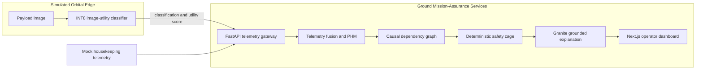

# SpaceBNS

**AI-assisted hybrid ground-edge mission assurance for resource-constrained spacecraft**

[](#selected-challenge-theme)
[](LICENSE)
[](#current-project-status)

SpaceBNS is a public proof-of-concept developed by **BNS Innovation** for the IBM August Challenge. It is designed to transform fragmented spacecraft imagery, housekeeping telemetry, and command context into evidence-grounded, forecast-aware, and policy-constrained mission decisions.

> **Safety and maturity notice:** This repository is an educational challenge prototype using synthetic data. It is not flight-qualified, does not connect to a spacecraft, and does not authorize or transmit spacecraft commands.

## Selected Challenge Theme

**August Challenge — Advance Space Exploration with AI**

SpaceBNS addresses the challenge objective of moving space operations from data-heavy monitoring toward insight-driven decision support. The MVP focuses on mission safety, reliability, operator comprehension, and the responsible use of AI in communications-constrained environments.

## Problem Statement

Spacecraft operations teams receive large volumes of housekeeping telemetry, payload imagery, command history, and communications-status data. These sources are often reviewed through separate tools, making it difficult to detect weak signals, correlate an anomaly with recent operational activity, forecast its mission impact, and present operators with a timely, explainable response option.

For small spacecraft and deep-space missions, the bottleneck is intensified by limited onboard compute, constrained downlink, intermittent contact, and limited operator attention. A low-value image can consume storage and downlink capacity, while a payload activity can simultaneously change the spacecraft power profile. Treating payload data quality and vehicle health as unrelated problems can hide important cross-layer evidence.

The SpaceBNS MVP targets one bounded scenario:

1. A simulated payload imaging burst increases electrical load.
2. A resource-constrained edge inference result marks the current observation as low utility.
3. Housekeeping telemetry indicates declining bus voltage and battery state of charge.
4. Command activity and subsystem relationships provide causal context.
5. The system recommends deferring only low-priority future imaging.
6. A deterministic policy gate limits the response to a simulated, reversible action.

## Solution Description

SpaceBNS is an **AI-assisted hybrid ground-edge mission-assurance prototype**. Its intended decision lifecycle is:

**Acquire → Validate → Detect → Isolate → Diagnose → Prognose → Recommend → Assure → Simulate → Audit**

The public MVP is designed around five boundaries:

- **Probabilistic AI detects symptoms; it does not declare an unquestionable root cause.**
- **Physics and telemetry provide quantitative operational context.**
- **A causal/dependency graph ranks evidence relationships.**
- **A deterministic safety cage evaluates allowable responses.**
- **Generative AI explains validated evidence but cannot authorize commands.**

## System Architecture



### Public Ground-Side Stack

- **FastAPI:** telemetry ingestion, health checks, and public mock-scenario endpoints.
- **Next.js and TypeScript:** operator-facing mission-assurance dashboard.
- **NetworkX/JSON graph — planned MVP module:** subsystem dependencies and causal evidence traversal.
- **Physics-informed power forecast — planned MVP module:** rolling battery state-of-charge and threshold prediction.
- **watsonx.ai/IBM Granite — planned MVP integration:** evidence-grounded operator explanations.
- **SQLite — planned MVP module:** audit records, evidence identifiers, timestamps, and decision provenance.
- **FAISS — planned MVP module:** local retrieval of approved manuals and operating procedures.
- **Docker Compose:** reproducible ground-side development and demonstration environment.

### Simulated Orbital-Edge Profile

The planned edge module performs narrow **image-quality and mission-utility assessment**. It is intended to explore INT8 quantization, bounded inputs, deterministic status codes, and static-memory inference. Docker is not claimed as the flight runtime. Any future LEON3/SPARC V8 profile would require target-specific cross-compilation, processor-representative benchmarking, mission interfaces, and formal verification and validation.

### Safety Boundary

The public prototype implements or plans the following assurance pattern:

- LLM output is non-authoritative.
- Candidate responses must pass an explicit allowlist and precondition checks.
- Unsafe, unsupported, or ambiguous cases fail closed to operator review.
- The MVP response is simulation-only.
- No source in this repository is approved for safety-critical operations.

See [docs/architecture.md](docs/architecture.md) for component boundaries and [docs/ip-safeguard.md](docs/ip-safeguard.md) for the public/private IP boundary.

## AI Approach and Architecture

SpaceBNS uses a **hybrid neural-symbolic decision-support approach**:

1. A narrow vision model is planned to classify observable image symptoms and estimate mission utility.
2. Telemetry analytics detect deviations in voltage, current, payload power, and battery state.
3. A physics-informed model forecasts energy-state evolution.
4. An explicit causal/dependency graph ranks diagnostic hypotheses using telemetry, command activity, and subsystem relationships.
5. A deterministic policy engine accepts or rejects candidate responses.
6. Granite generates an operator-readable explanation from validated evidence and retrieved authoritative material.

The architecture does **not** treat an image symptom as proof of a hardware failure. Root-cause hypotheses require corroborating telemetry and command evidence. The system must also be able to return **insufficient evidence** rather than force a diagnosis.

## How IBM Bob Was Used

IBM Bob is the required primary development tool for the challenge implementation. It is an AI software-development lifecycle partner—not a runtime spacecraft component.

The team will document real Bob-assisted work in [docs/bob-usage.md](docs/bob-usage.md), including:

- architecture and task planning;
- FastAPI and Next.js scaffolding;
- implementation and refactoring;
- unit-test generation;
- debugging and code review;
- Docker and CI configuration; and
- technical documentation.

**Submission rule:** Only work actually performed with IBM Bob should be recorded as completed. Prompt summaries, affected files, human corrections, and validation evidence should be added throughout development.

## Current Project Status

| Capability | Status | Public evidence |
| --- | --- | --- |
| Public repository and Apache-2.0 licensing | Implemented | `LICENSE`, `NOTICE` |
| Synthetic telemetry dataset | Implemented | `data/mock/telemetry.json` |
| FastAPI health and mock-scenario endpoints | Implemented | `backend/app/main.py` |
| Next.js operator dashboard shell | Implemented | `frontend/app/` |
| Docker Compose development environment | Implemented | `docker-compose.yml` |
| Deterministic mock assessment | Implemented baseline | `/api/v1/mock/assessment` |
| Edge INT8 vision inference | Planned MVP work | Not yet claimed |
| NetworkX causal diagnosis | Planned MVP work | Not yet claimed |
| Physics-informed 24-hour forecast | Planned MVP work | Not yet claimed |
| watsonx.ai/Granite grounded explanation | Planned MVP work | Not yet claimed |
| Autonomous spacecraft commanding | Explicitly out of scope | Simulation only |

## Quick Start

### Docker Compose

```bash
cp .env.example .env
docker compose up --build
```

Then open:

- Dashboard: `http://localhost:3000`
- API documentation: `http://localhost:8000/docs`
- Health check: `http://localhost:8000/health`

### Backend only

```bash
python -m venv .venv
source .venv/bin/activate
python -m pip install -r backend/requirements.txt
uvicorn backend.app.main:app --reload
```

Run tests:

```bash
pytest backend/tests
```

### Frontend only

```bash
cd frontend
npm install
npm run dev
```

## Public API Endpoints

| Method | Endpoint | Purpose |
| --- | --- | --- |
| `GET` | `/health` | Service and safety-mode health response |
| `GET` | `/api/v1/mock/telemetry` | Returns explicitly synthetic spacecraft telemetry |
| `GET` | `/api/v1/mock/assessment` | Runs a deterministic public demonstration assessment |

## Repository Structure

```text
SpaceBNS/
├── backend/                 # Public FastAPI orchestration scaffold
├── frontend/                # Public Next.js dashboard scaffold
├── data/mock/               # Synthetic, non-mission telemetry
├── docs/                    # Architecture, Bob evidence, and IP boundary
├── .github/workflows/       # Basic public CI
├── .env.example             # Names only; never real secrets
├── docker-compose.yml
├── LICENSE
├── NOTICE
└── README.md
```

## IP and Data Safeguards

This public repository intentionally includes only:

- general orchestration and interface code;
- public dashboard layout;
- synthetic mock telemetry; and
- non-proprietary documentation and tests.

It intentionally excludes proprietary model weights, custom training data, private parsing methods, real aerospace topology, customer information, credentials, and mission-sensitive procedures. **Anything committed publicly should be treated as disclosed and licensed under this repository's Apache-2.0 terms.**

## Limitations

- The telemetry is synthetic and does not represent a real vehicle.
- The assessment endpoint is a transparent deterministic baseline, not a trained diagnostic model.
- The edge node and response execution are simulated.
- No flight processor timing, radiation tolerance, or flight qualification is claimed.
- Standards are design references only; this prototype is not certified as NASA- or ECSS-compliant.

## Team

**Tarek Aref** — Founder, BNS Innovation; project lead and developer

## License and Copyright

Copyright 2026 BNS Innovation.

The public files in this repository are licensed under the [Apache License 2.0](LICENSE). Excluded proprietary BNS Innovation technology is not contributed or licensed by implication.

