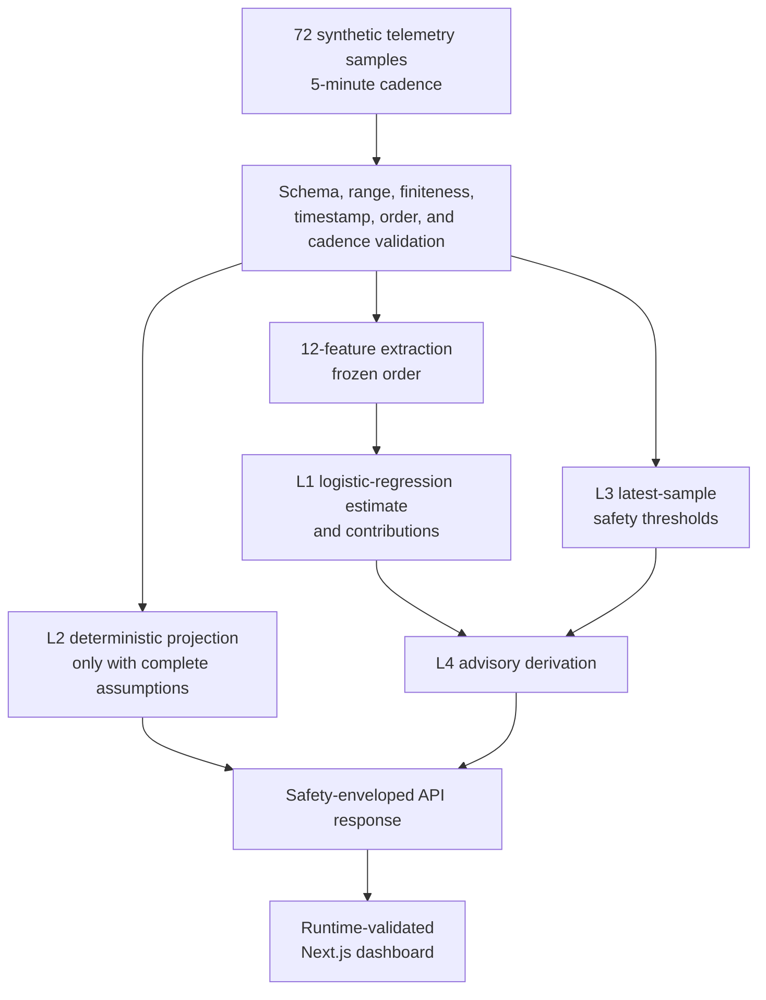

# SpaceBNS Architecture

## Architectural intent

SpaceBNS is an advisory-only power-risk prototype. Its central design rule is
separation: a statistical estimate, a deterministic projection, safety rules,
and an operator recommendation remain distinct outputs with distinct evidence
and limitations.

The implemented MVP uses synthetic telemetry only. It has no spacecraft
connection, command path, uplink, or autonomous-control capability.

## End-to-end flow



## Input contract

Each telemetry sample requires eight raw fields:

| Field | Role |
| --- | --- |
| `timestamp` | Strict UTC ordering and five-minute cadence |
| `battery_soc_percent` | ML feature source and safety evidence |
| `bus_voltage_v` | ML feature source and safety evidence |
| `solar_array_current_a` | ML feature source |
| `payload_power_draw_w` | ML feature source and safety evidence |
| `command_activity` | Validated context; excluded from the ML vector |
| `communications_status` | Validated context; excluded from the ML vector |
| `image_utility_score` | Validated context; excluded from the ML vector |

Normal inference requires 72 samples. The approved feature order is:

1. `soc_latest`
2. `soc_mean`
3. `soc_min`
4. `soc_slope`
5. `voltage_latest`
6. `voltage_min`
7. `voltage_slope`
8. `solar_current_mean`
9. `solar_current_slope`
10. `payload_draw_mean`
11. `payload_draw_max`
12. `high_draw_fraction`

The implementation rejects feature-set or feature-order drift rather than
silently reshaping inputs.

## Four-layer responsibility boundary

| Layer | Responsibility | Explicit non-responsibility |
| --- | --- | --- |
| L1 — AI estimate | Estimate a synthetic-distribution breach probability and expose feature contributions | Does not prove physical causation or predict real-spacecraft reliability |
| L2 — deterministic projection | Apply the documented energy-balance method when all physical assumptions are present | Does not infer missing capacity, load, efficiency, sunlight, or schedule assumptions |
| L3 — safety thresholds | Evaluate explicit rules against the latest sample | Does not learn thresholds or select commands |
| L4 — operator advisory | Combine L1 probability and L3 findings into a bounded recommendation | Does not authorize, schedule, or execute an action |

The L2 result is never represented as AI output. When its required assumptions
are incomplete, the API returns `deterministic_projection: null` and a fixed
omission reason.

## Model lifecycle and numerical safeguards

The training script:

1. generates 300 deterministic synthetic scenarios with seed 42;
2. preserves class-balanced train, validation, and test splits of 180/60/60;
3. selects logistic-regression regularization using train and validation data
   only;
4. fits the final scaler/classifier pipeline on the combined 240 train and
   validation scenarios;
5. detects features with effectively zero training variation;
6. retains those features in the public 12-field schema while neutralizing
   their coefficients; and
7. serializes model version `0.1.1`.

The frozen model neutralizes `solar_current_slope`: scaler scale `1.0`,
coefficient `0.0`. This prevents floating-point noise in an effectively
constant training feature from dominating displayed contributions or
inference.

At load and inference time, SpaceBNS validates pipeline structure, feature
dimensions, class labels, scaler values, coefficients, standardized values,
contributions, and probability finiteness. Any invalid model state fails closed
as `MODEL_NOT_LOADED` or a fixed prediction failure.

## Safety and failure behavior

All prediction paths preserve:

```json
{
  "data_source": "SYNTHETIC",
  "prototype_status": "NOT_FLIGHT_QUALIFIED",
  "command_authority": "NONE",
  "policy_decision": "PERMITTED_FOR_SIMULATION_ONLY"
}
```

Failure behavior is deliberately bounded:

- empty or invalid telemetry returns a fixed 422 response;
- a missing or invalid model returns a fixed 503 response when inference is
  required;
- incomplete projection assumptions return a fixed 422 response;
- internal feature or prediction failures use fixed public errors;
- raw API bodies, stack traces, exception text, and filesystem paths are never
  returned; and
- no response can create command authority.

## API boundary

| Endpoint | Function |
| --- | --- |
| `GET /health` | Deployment and safety-mode probe |
| `GET /api/v1/mock/telemetry` | Preserved five-sample synthetic telemetry |
| `GET /api/v1/mock/assessment` | Preserved deterministic baseline |
| `POST /api/v1/power-risk/predict` | Caller-supplied four-layer prediction |
| `GET /api/v1/mock/power-risk-prediction` | Public 72-sample four-layer demonstration |

Both prediction endpoints call the same core prediction service. The mock
endpoint is a reproducible demonstration adapter, not a second inference
implementation.

## Dashboard boundary

The Next.js dashboard:

- fetches the public mock prediction once at load;
- validates both normal and degraded response structures at runtime;
- verifies the exact safety-envelope values before rendering;
- derives probability, projection, audit, and contribution displays from the
  API;
- renders the L1–L4 boundaries and audit provenance;
- provides accessible SVG title and description text;
- offers a manual retry after an API failure; and
- performs no polling.

It is an advisory display, not a flight-control console. Browser-extension
console errors are outside the application boundary.

## Reproducible build boundary

`data/models/power_risk_classifier.joblib` is generated and Git-ignored.

- Local users run
  `python -m backend.scripts.train_power_risk_model` before starting the API.
- The backend Docker image runs the same training command during its clean
  build.
- Continuous integration runs the same command before backend tests.

A clean worktree generated a model with the same SHA-256 digest as the validated
local artifact and passed the safety-enveloped API smoke test.

## Explicit non-goals

The implemented MVP does not include:

- real spacecraft telemetry or interfaces;
- image processing or edge inference;
- NetworkX causal reasoning;
- Granite, a large language model, or retrieval-augmented generation;
- collision avoidance or attitude control;
- command generation, scheduling, transmission, or execution;
- flight-processor timing or radiation testing; or
- certification, compliance, qualification, or flight heritage.

Those ideas are roadmap candidates only and would require independent data,
interfaces, verification, and safety cases.
